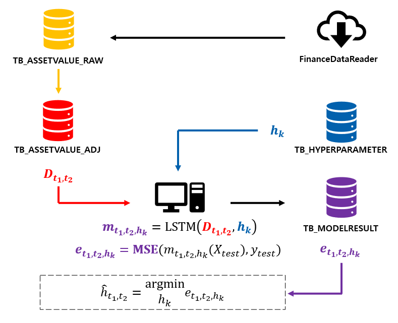

# 하이퍼파라미터 튜닝 : LSTM 모델  
최초 작성일 : 2024-01-06  
마지막 수정일 : 2024-01-06
  
## 0. Overview
시계열 데이터를 예측하는 LSTM 모델을 구축하고, DataBase(Mysql)을 이용해서, 하이퍼파라미터 튜닝을 시도하였다.

## Table of Contents
1. [Introduction](#1.-Introduction)
2. [DataFlow](#2.-DataFlow)
3. [WorkFlow](#3.-WorkFlow)

## 1. Introduction 

LSTM(Long Short-Term Memory)는 순환 신경망(RNN, Recurrent Neural Network)의 한 종류로, 주로 시계열 데이터나 자연어 처리 등의 문제에 적용되는 딥러닝 모델이다. LSTM은 RNN이 갖는 한계점 중 하나인 '기울기 소실' 문제를 해결하고 정보의 장기 의존성을 효과적으로 학습할 수 있는 장점이 있다.

한편, 하이퍼파라미터 튜닝(Hyper-Parameter Tunning)은 머신러닝 모델의 성능을 최적화 하기 위해 모델의 하이퍼파라미터를 조정하는 프로세스를 의미한다. 하이퍼파라미터는 모델을 학습하는 동안 일정하게 유지되는 파라미터로, 하이퍼파라미터 튜닝 과정을 통해 모델의 성능을 향상시키기 위해 다음과 같은 단계로 최적의 세팅을 찾는 작업이 수행된다.

1. 하이퍼파라미터 정의
2. 탐색 공간 정의
3. 최적화 알고리즘 선택
4. 실행 수행 및 평가
5. 최적의 하이퍼 파라미터 선택 및 최종 학습 모델

하이퍼파라미터 정의는 어떤 하이퍼 파라미터를 최적화 시킬 것인지에 대해 정의하는 단계이다. 대표적인 하이퍼파라미터로는 학습률(learning rate), 배치 크기(batch size), 은닉층 크기(size of hidden layer), 규제화 매개변수(penalty parameter) 등이 있다. 본 실험에서는 에포크(Epoch), 배치 크기(Batch size), 학습률(learning rate), 학습 데이터 비율(ratio of train set), LSTM 모델 내 window 크기(size of sequence), 입력층 크기(size of input), 은닉층 크기(size of hidden), 출력층 크기(size of output)으로 정의하였다.

탐색 공간 정의는 각 하이퍼 파라미터에 대한 탐색 범위를 정의하는 단계이다. 본 실험에서는 다음과 같이 탐색 범위를 정의했으며, 실험은 각 하이퍼 파라미터의 순서쌍(Catesian product)에 대해서 수행 및 평가가 이루어진다.
|Name|Search Space Size|Value|
|:--:|:--:|:--:|
|Epoch|2|20, 30|
|Batch Size|2|10, 20|
|Learning Rate|2|0.001, 0.005|
|Ratio of train set|2|0.8, 0.9|
|size of sequence|1|50|
|size of input|2|50, 64|
|size of hidden|2|64, 128|
|size of output|1|1|

최적화 알고리즘은 하이퍼 파라미터 튜닝 과정에서 어떤 하이퍼 파라미터 조합을 시도할 것인지를 결정하는 방법을 의미하고, 주로 랜덤 서치(Random Search), 그리드 서치(Grid Search), 베이지언 최적화(Baysian Optimization)을 사용하며, 각 방법은 계산 비용과 효율에 대한 장담점이 존재한다. 본 실험에서는 정의한 전체 탐색 곤간을 탐색할 수 있는 그리드 서치 방법을 선택한다.

실행 수행 및 평가는 하이퍼파라미터 공간 내 각 순서쌍에 대해 반복적으로 모델을 학습하고, 평가하여, 성능을 기록하여, 최적의 하이퍼 파라미터를 찾는 과정을 의미한다. 본 실험에서는 DataBase에 Table를 구축해서, 실행 수행 전 탐색 할 하이퍼파라미터를 미리 저장해놓고, 순서쌍에 대해 작업 코드(task code)를 부여하여, 하이퍼 파라미터 순서쌍과 모델의 지표를 관리하였다. 이 후, 예측이 가장 잘 된 모델을 결정하기 위해 실제값과 예측값 사이의 평균 제곱 오차(MSE, Mean Squaere Error)를 계산하여, 가장 작은 MSE를 갖는 작업 코드를 찾는 방식으로 하이퍼파라미터 튜닝을 구성하였다.

$$\hat{h} = \arg\min_{h}\sum_{i \leq n} \left[ \text{Actual Data}(i) - \text{Predicted Data}(i)(h) \right]^2$$

## 2. Dataflow
본 실험에서 하이퍼파라미터 튜닝을 자둥화하기 위해 Mysql DataBase를 사용했으며, 총 5개의 테이블을 정의하였다. 모든 테이블에는 공통적으로 DATE_UPDATE 필드가 존재하며, 데이터가 언제 삽입(insert), 업데이터(update)가 되었는지 시스템 시간이 기록된다. 시계열 데이터(주식, 금리, 환율 등)는 티커(Ticker)를 통해 고유성을 나타내고, 하이퍼파라미터 순서쌍은 작업 코드(code_task)에 의해 고유성이 보장된다. 테이블 TB_ASSETVALUE_RAW, TB_ASSETVALUE_ADJ, TB_HYPERPARAMETER, TB_MODELRESULT는 시계열 데이터, 하이퍼 파라미터, 모델 결과값이 저장되지만, 테이블 TB_TASKSTATUS는 모델에 관한 데이터가 적재되는 것이 아닌 작업을 관리하고, 진행도를 모니터링하는 용도로 설계된 테이블이다. 각 테이블의 정의과 스펙은 아래 표와 같다.

1. TB_ASSETVALUE_RAW  
원천(source)로부터 입수된 시계열 데이터를 저장하는 테이블

|Field|Type|Null|Key|Description|
|:--:|:--:|:--:|:--:|:--:|
|DATE_MARKET|varchar(20)|NO|PRI|시장 기준일|
|TICKER|varchar(20)|NO|PRI|티커|
|OPEN_P|float|YES||시가|
|HIGH_P|float|YES||고가|
|LOW_P|float|YES||저가|
|CLOSE_P|float|YES||종가|
|VOLUME|float|YES||거래량|
|DATE_UPDATE|datetime|YES||데이터 업데이트 일시|

2. TB_ASSETVALUE_ADJ  
전처리 후 학습에 활용하는 시계열 데이터를 저장하는 테이블

|Field|Type|Null|Key|Description|
|:--:|:--:|:--:|:--:|:--:|
|DATE_MARKET|varchar(20)|NO|PRI|시장 기준일|
|TICKER|varchar(20)|NO|PRI|티커|
|OPEN_P|float|YES||시가|
|HIGH_P|float|YES||고가|
|LOW_P|float|YES||저가|
|CLOSE_P|float|YES||종가|
|VOLUME|float|YES||거래량|
|DATE_UPDATE|datetime|YES||데이터 업데이트 일시|

3. TB_HYPERPARAMETER  
탐색하고자 하는 하이퍼파라미터 순서쌍을 저장하는 테이블

|Field|Type|Null|Key|Description|
|:--:|:--:|:--:|:--:|:--:|
|CODE_TASK|varchar(20)|NO|PRI|작업 코드|
|EPOCH|int|YES||에포크|
|BATCH_SIZE|int|YES||배치 크기|
|LEARNING_RATE|float|YES||학습률|
|RATIO_TRAIN_SET|float|YES||학습 데이터 비율|
|SIZE_SEQUENCE|int|YES||LSTM 모댈 내 window 크기|
|SIZE_UNIT_INPUT|int|YES||입력층 크기|
|SIZE_UNIT_HIDDEN|int|YES||은닉층 크기|
|SIZE_UNIT_OUTPUT|int|YES||출력층 크기|
|DATE_UPDATE|datetime|YES||데이터 업데이트 일시|

4. TB_MODELRESULT  
모델 학습 후, 결과물을 저장하는 테이블

|Field|Type|Null|Key|Description|
|:--:|:--:|:--:|:--:|:--:|
|CODE_TASK|varchar(20)|NO|PRI|작업 코드|
|TICKER|varchar(20)|YES||티커|
|VERSION_MODEL|int|YES||모델 버전|
|DATE_B_TRAIN|varchar(20)|YES||Train set의 시작일(YYYYMMDD)|
|DATE_E_TRAIN|varchar(20)|YES||Train set의 종료일(YYYYMMDD)|
|DATE_B_TEST|varchar(20)|YES||Test set의 시작일(YYYYMMDD)|
|DATE_E_TEST|varchar(20)|YES||Test set의 종료일(YYYYMMDD)|
|LOSS|float|YES||손실|
|ACCURACY|float|YES||정확도|
|MSE|float|YES||평균제곱오차(Mean Square Error)|
|DATE_UPDATE|datetime|YES||데이터 업데이트 일시|

5. TB_TASKSTATUS  
작업 진행 상황을 모니터링하기 위한 테이블

|Field|Type|Null|Key|Description|
|:--:|:--:|:--:|:--:|:--:|
|CODE_TASK|varchar(20)|NO|PRI|작업 코드|
|TICKER|varchar(20)|YES||티커(데이터 코드)|
|IDX_TASK|int|YES||작업 인덱스|
|STATUS|varchar(20)|YES||상태값|
|NOTE|varchar(300)|YES||에러 내용|
|DATE_UPDATE|datetime|YES||데이터 업데이트 일시|
   
위 테이블을 이용하여, 실험의 데이터 흐름(Dataflow)를 나타내면 아래 흐름도와 같다.


## 3. Workflow 

실험을 수행하기 위해 처음 시계열과 어느 기간의 데이터를 사용할 것인지 선택해서 입력해야한다. 예를 들어, 원화(KRW)에 대한 달러(USD) 환율을 예측 하기 위해 'USD/KRW' 티커를 사용하고, 데이터의 시작일을 '2013-01-01'과 종류일을 '2022-12-31'로 정의한다.
```python
ticker = 'USD/KRW'
date_begin = '2013-01-01'
date_end = '2022-12-31'
```

작업에 필요한 데이터베이스 테이블을 생성하고, 필요한 값을 입력하기 위해 task_utils.py를 실행한다. 필요한 테이블이 존재하는지 확인(함수 'check_table')하고, 존재하지 않을 경우, 테이블을 생성(함수 'create_table')한다. 이 후, 정의한 하이퍼파라미터의 탐색공간에 대한 값을 테이블에 입력(함수 'initiate_table_hyperparameter')에 입력하고, 작업 진행 상황을 모니터링하기 위해 수행하고자 하는 작업 리스트를 세팅(함수 'initiate_table_taskstatus')한다. 모든 작업이 수행되면, 세팅에 대한 완료 flag를 테이블 TB_TASKSTATUS에 기록(함수 'update_taskstatus('SETTING_DBTABLE', ticker, 'Completed', None)')한다.
    
```python
list_table = ['TB_ASSETVALUE_RAW',
                'TB_ASSETVALUE_ADJ',
                'TB_HYPERPARAMETER',
                'TB_MODELRESULT',
                'TB_TASKSTATUS']
    
for table in list_table :
    if check_table(table) :
        print ('Table %s already exists.' %table)
    else : 
        try :
            create_table(table)
            print ('Table %s created.' %table)
        except Exception as e :
            print ('[ERROR] %s' %str(e))

initiate_table_hyperparameter()

initiate_table_taskstatus(ticker)

update_taskstatus('SETTING_DBTABLE', ticker, 'Completed', None)
```
